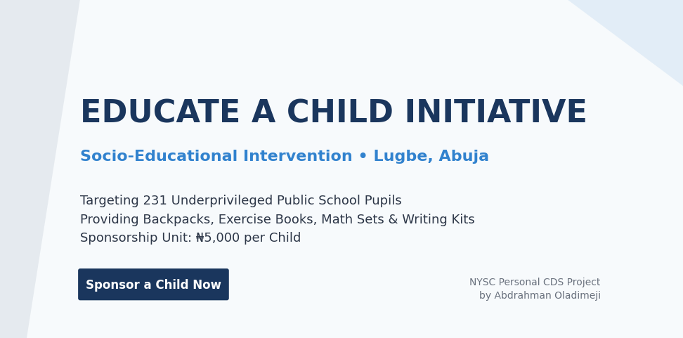

# Educate a Child Initiative — Landing & Payment Gateway

A lightweight, high-performance single-page web application engineered to drive sponsorship and process donations for the **"Educate a Child" Initiative**. This localized community development project is scheduled for execution at **LEA Primary School, Lugbe, Abuja**.



## 📋 Project Overview

The core objective of this socio-educational intervention is to fully equip **231 underprivileged public primary school pupils** (transitioning from Primary 3 and 4 into the next academic session) with comprehensive "Education Kits". Each kit is strictly optimized at **₦5,000 per pupil** and contains:
* 1 Standardized Packaging Backpack
* 6 Exercise Books (40-leaves)
* 1 Mathematical Set
* 1 Motivational Storybook / Reader
* Writing Pens, Pencils, Sharpener, and Eraser

This platform provides an interactive user interface for individual philanthropists and corporate sponsors to seamlessly select tier-based sponsorship blocks or input custom donation amounts processed securely via Paystack.

## ⚡ Tech Stack

* **Frontend Library:** React.js (Functional Components & Hooks)
* **Styling Framework:** Tailwind CSS (Utility-first responsive design)
* **Payment Gateway API:** Paystack Inline JS SDK (Secure local currency infrastructure)

## 🚀 Getting Started

### Prerequisites

Ensure you have [Node.js](https://nodejs.org/) installed on your machine.

### Installation

1. **Clone the repository:**
   ```bash
   git clone [https://github.com/yourusername/educate-a-child.git](https://github.com/yourusername/educate-a-child.git)
   cd educate-a-child

```

2. **Install dependencies:**
```bash
npm install

```


3. **Include the Paystack SDK:**
Ensure the Paystack Inline script is present in your public structural file (e.g., `public/index.html` or `index.html`):
```html
<script src="[https://js.paystack.co/v1/inline.js](https://js.paystack.co/v1/inline.js)"></script>

```


4. **Configure Environment API Keys:**
Open `src/App.jsx` and replace the placeholder credential with your public key from the Paystack Dashboard:
```javascript
key: 'pk_live_YOUR_PUBLIC_KEY_HERE',

```


5. **Run the development server:**
```bash
npm run dev

```


## 🔧 Paystack Dashboard Configuration

To maintain operational sync with the web application’s routing flow:

1. Log into your **Paystack Dashboard** ➔ **Settings** ➔ **API Keys & Webhooks**.
2. Set your **Callback URL** to point to your live deployment domain (e.g., `https://yourdomain.com/`).
3. Under your explicit Payment Page configurations, set the **Redirect after payment** path to point directly to your success parameter (`https://yourdomain.com/?status=success`) to automatically trigger the app's dedicated gratitude panel.

## 📄 License

This project is deployed under the MIT License.

---

*Pioneered as a Personal Community Development Service (CDS) Project by Abdrahman Oladimeji (Corps Member, FCT)*.
